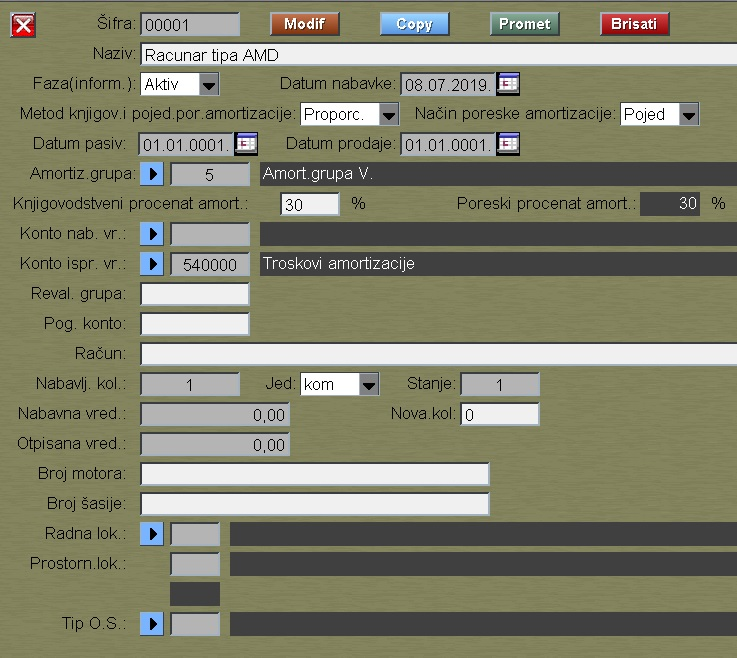

# Osnovno sredstvo

Program "Osnovno sredstvo" se poziva iz menija [Alati](../r1_sr.md)

Metod knjigovodstvene amortizacije i metod poreske 
amortizacije u slučaju pojedinačne kartice (nova nabavka):

- Proporcionalna , kada je osnovica nabavna vrednost.
- Degresivna . kada je osnovica ostatak vrenosti.

Metod poreske amortizacije za slučaj grupne obrade je definisan u programu [Amortiz-grupe](../mk013_sr/mk013_sr.md).

Poresku amortizaciju program kalkuliše:
- Pojedinačno (nabavka od 01.01.2019, pojedinačna kalkulacija)
- Grupno (na starim karticama, ali i ovde imamo i pojed.vrednosti)

Pritiskom na taster "Promet" ulazimo u deo gde se vode promene
vrednosti osnovnog sredstva:

Promet se vodi posebno za karticu:

  1-knjigov kartica

  2-poreska kartica

Kod svakog prometa moramo zadati vrstu prometa:

