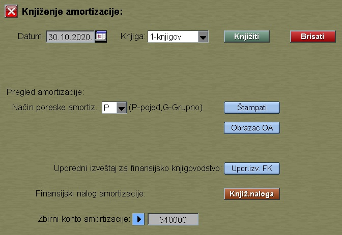

# Izveštaji-OS

Program "Izveštaji-OS" se poziva iz menija [Alati](../r1_sr.md)

U okviru ovih izveštaja imamo "Knjiženje amortizacije".

Moramo izabrati datum obrade i knjigovodstveni oblast:

- 1-knjigov
- 2-poreska

Taster "Knjiženje" kalkuliše i dodaje knjižne redove na svaku karticu osnovnog sredstva.

Poresku amortizaciju kalkuliše u dve etape, posebno za 
- Pojedinačno (nabavka od 01.01.2019, pojedinačna kalkulacija)
- Grupno (na starim karticama, ali i ovde imamo i pojed.vrednosti)

Taster "Brisati" briše svaku amortizaciju izabrane oblasti za taj datum.

Kod knjigovodstvene amortizacije imamo samo jedno štampanje.

Kod poreske amortizacije imamo četiri štampanja zavisno od načina i od metode amortizacije.
