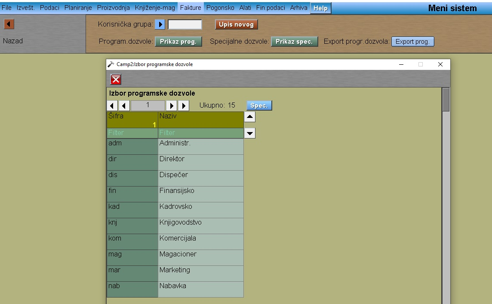
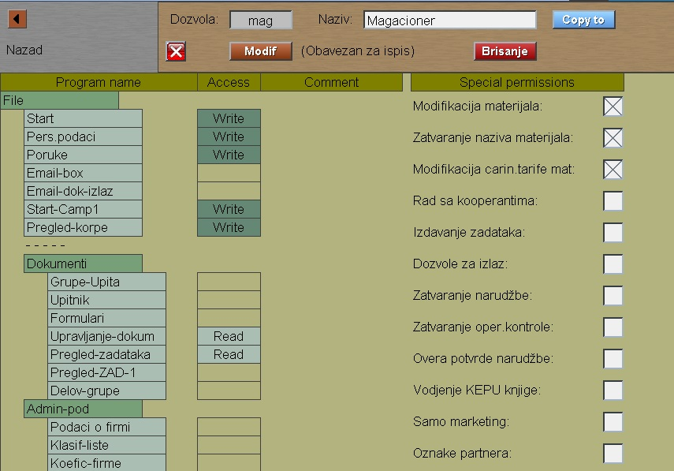
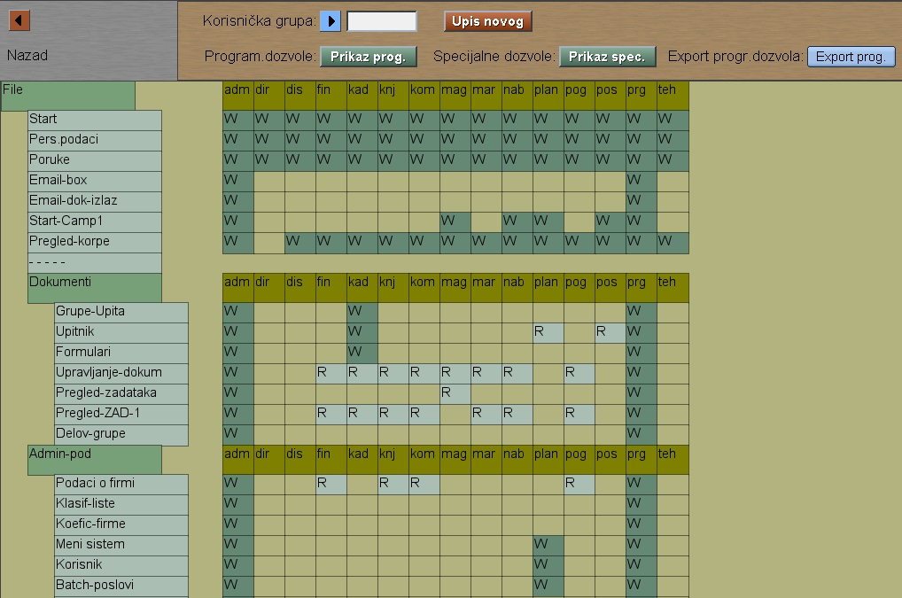
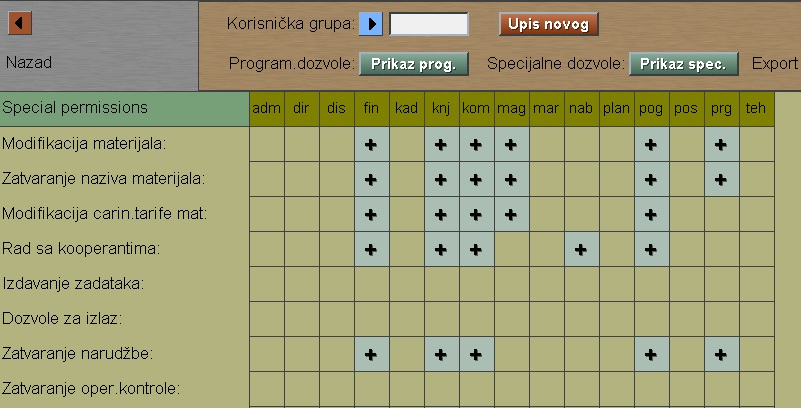

# Meni-sistem

Program Meni-sistem se poziva iz menija [Admin-pod](../x2_sr.md)

U gornjem delu ekrana imamo mogućnost upisa nove krisničke grupe.
Šifra grupe (oblast rada, šifra dozvole) može biti 
- 3-4 slova:  mag
- ili specifičnije:  mag.mat

Korisničke grupe možemo birati klikom na plavu strelicu za izbor.

Tada imamo pregled programa samo za tu grupu:

Taster "Copy to"  služi za upis nove korisničke grupe
kopiranjem izabrane grupe.

Tabelarni prikaz i modifikacija programskih dozvola
za sve korisničke grupe dobijamo kada u početku kliknemo
na taster "Prikaz prog." :

Levi klik na neko polje povećava nivo pristupa (W - Write) ,
dok desni klik smanjuje taj nivo (R - Read).

Pritiskom na taster "Prikaz spec." nam omogućuje da menjamo
specijalne dozvole u nekim programima:

Napomena:  Ovako upisane promene nisu aktivni odmah, već
posle ponovnog logovanja korisnika.

Drop-down lista oblasti rada se isto učitava kod startovanja programa.
