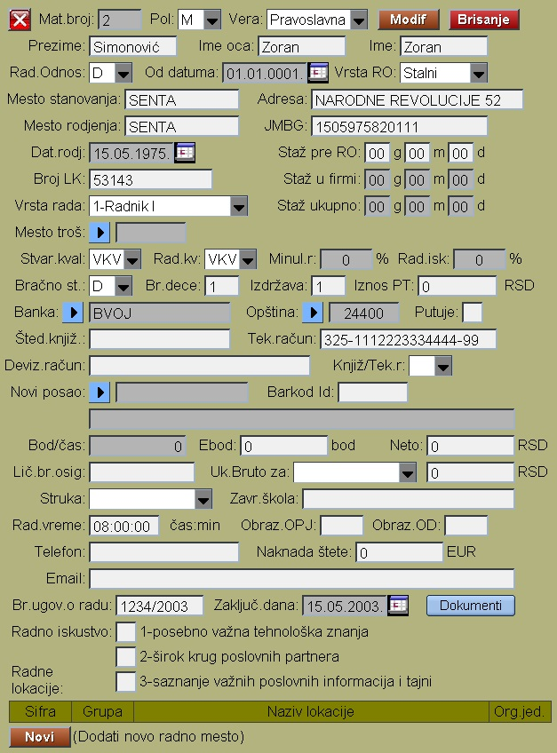

# Matič.pod.radnika

Program "Matič.pod.radnika" se poziva iz menija [Zaposleni](../z_sr.md)

Prilikom unosa podataka obavezno moramo upisati:

- Prezimi, Ime i Ime jednog od roditelja
- Radni odnos (D,N)
- Vrstu radnog odnosa
- Mesto stanovanja, mesto rodjenja
- JMBG ili broj pasoša
- Datum rodjenja i broj L.K
- Stvarnu kvalifikaciju i radnu.
- Banka kod koje radnik prima platu i tekući račun
  (definišemo u programu  [Žiro-račun](../../l_sr/ob001_sr/ob001_sr.md))
- Opština kojoj pripada (definišemo u programu 
  [Opštine](../../l_sr/ob003_sr/ob003_sr.md))
- Da li prima putni trošak
- Dužinu radnog vremena
- Broj ugovora o radu i datum ugovora:

Posle upisa Matičnih podataka sledi upis njegovog rasporeda u programu 
 [Raspored-Radnika](../ob104_sr/ob104_sr.md)

 