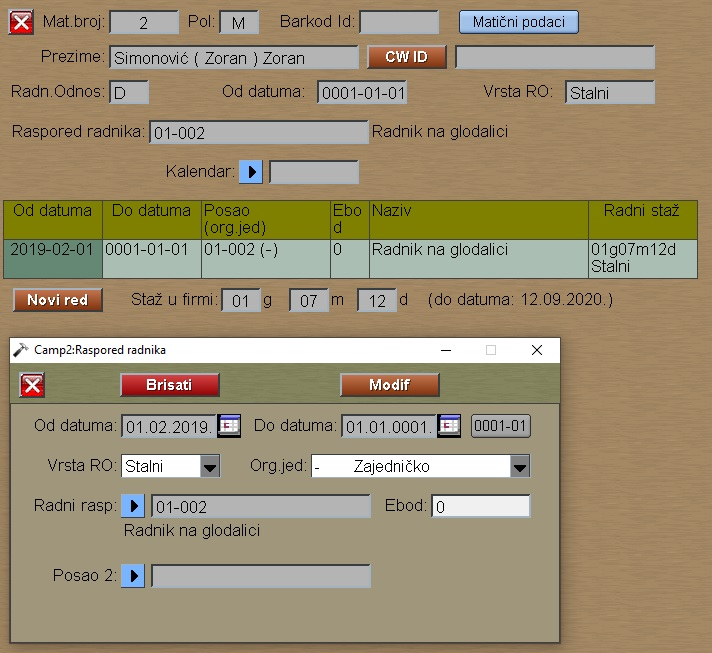

# Raspored-Radnika

Program "Raspored-Radnika" se poziva iz menija [Zaposleni](../z_sr.md)

Ovde za svaki posao upisujemo datume važenja:

- Od datuma : početak važenja rasporeda
- Do datuma : Zadnj datum važenja rasporeda ili zero datum, ako je neodredjen.

Posao radnika biramo iz organizacione šeme:
[Organiz.Šema](../../l_sr/ob101_sr/ob101_sr.md)

Ebod je bruto satnica radnika.
Kod obračuna plate se on množi sa koeficijentom 
za obračun boda i tako dobijamo bruto cenu rada po času.
