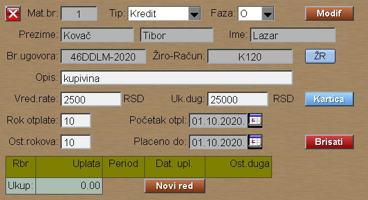

# Administ-Zabrane

Program "Administ-Zabrane" se poziva iz menija [Zaposleni](../z_sr.md)

Žiro-Račun se upisuje pomoću programa 
[Žiro-Račun](../../l_sr/ob001_sr/ob001_sr.md).
Tip ziro racuna: K - Kredit.
Isti Žiro-Račun možemo koristiri za više ugovora.
Žiro-Računi su sabirna mesta za uplate.

Datum početka otplate jo prvi dan prvog perioda, tj meseca plate,
od koje prva rata mora biti odbijena.

Datum plaćen do mora isto da bude prvi dan u mesecu.
Aku upisujete novu administr.zabranu, onda stavite da je
datum placen do jednak datumu početku otplate.

Ako već imamo x uplaćenih rata, onda razlika placen-do minus pocetak otplate mora biti x meseca.

Kod obračuna plate program automatski računa odbijene rate,
ako smo kod meseca označili da želimo automatsku obradu.

Program uzima u obzir isplaćene rate, ukupan dug i rok otplate.
Datum početka otplate i plaćen do je samo informativnog karaktera,
kao i datum uplate rate.

Ako kredit miruje, onda staviti da je faza Z , kao da je zatvorena, pa program neće odbiti rate.

Ako se kredit ponovo aktivira, onda rucno mora da se popravi datum pocetka otplate i datum plaćen do.

Kod isplaćenih kredita program te kredite zatvara uvek sledeceg meseca , kada vidi da je dug nula. Zatvarenje meseca nikako ne uraditi ručno, ili pre sledećeg meseca, jer tada bi program brisao zadnju ratu kod automatske obrade.

